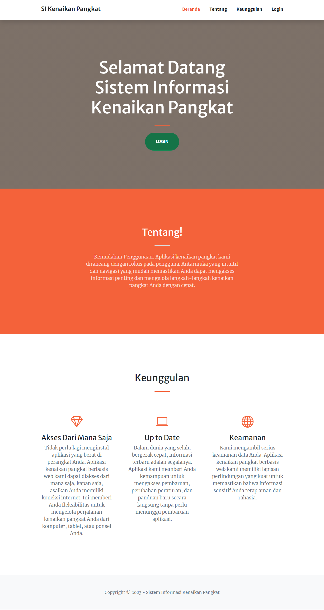
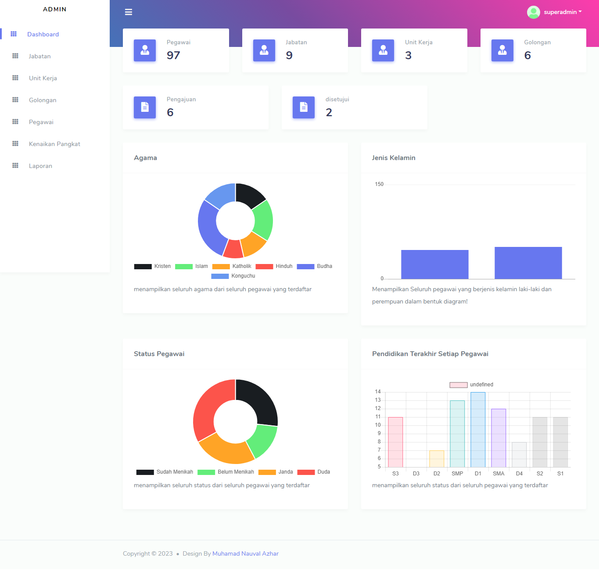
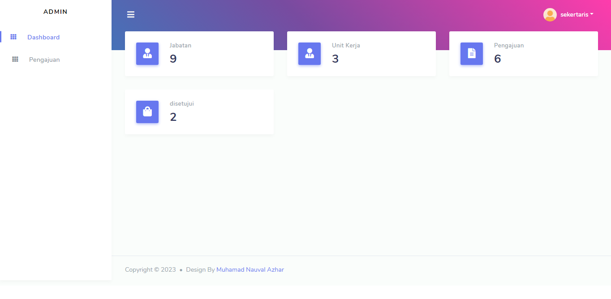
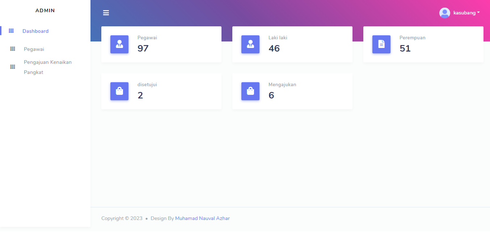

# Aplikasi Kenaikan Pangkat

## Penjelasan

Aplikasi Kenaikan Pangkat Pegawai Berbasis Web
Aplikasi ini merupakan aplikasi web yang digunakan untuk mengelola kenaikan pangkat pegawai. Aplikasi ini dibangun menggunakan framework Laravel versi 10, PHP versi 8, Bootstrap versi 5, dan Fontawesome.

## Fitur

* Pengguna dapat mengajukan kenaikan pangkat dengan mengisi formulir online.
* Pegawai yang mengajukan kenaikan pangkat dapat memantau status pengajuan kenaikan pangkatnya.
* Pegawai yang mengajukan kenaikan pangkat dapat melihat riwayat kenaikan pangkatnya.

## Prasyarat 

Laravel versi 10
PHP versi 8
MySQL
Composer
Git

## Instalasi

Clone repository ini ke komputer Anda:
```bash
git clone https://github.com/[nama-pengguna]/aplikasi-kenaikan-pangkat-pegawai.git
```
cd aplikasi-kenaikan-pangkat-pegawai
```bash
Masuk ke direktori aplikasi:
```

Instal dependensi:
```bash
composer install
```

Buat database baru:
```bash
mysql -u [nama-user] -p -e "CREATE DATABASE aplikasi_kenaikan_pangkat"
```

Konfigurasi database:
```bash
cp .env.example .env
```

Edit file .env dan ubah pengaturan database sesuai dengan konfigurasi Anda.

Migrasi database:
```bash
php artisan migrate
```

Jalankan aplikasi:
```bash
php artisan serve
```
## Tampilan






## License

The Laravel framework is open-sourced software licensed under the [MIT license](https://opensource.org/licenses/MIT).
